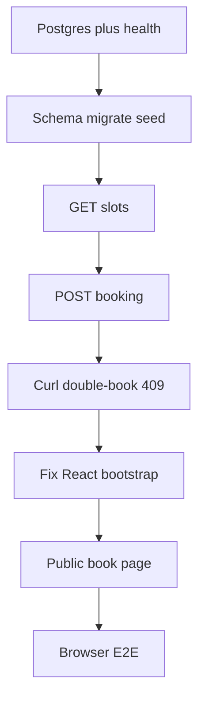

# BookMe v1 — how to approach it

The brief is [booking-saas-project-brief.txt.md](booking-saas-project-brief.txt.md). v1 is only: one hardcoded business, seeded slots, public book (a DB write), no auth.

## Start with the backend

Do **backend first**, then a thin frontend. v1’s value is the **booking contract** (list open slots, write a booking, refuse a double-book). That lives in Postgres + Express. A pretty UI with no API is a mock; an API you can curl is already a working product.

Frontend-first (sketch the page, fake JSON) is useful later for dashboard UX. Skip it for v1 — you already know the page is “list times, enter name/email, confirm.”

Order that matches the brief’s “dumbest version first”:

1. Database truth (schema + seed)
2. HTTP contract (GET slots, POST booking)
3. Prove the race with curl (unique `slotId` → 409)
4. Then attach React so a guest can do the same in a browser

Do not start v2 (auth, working hours, slug URLs) until that loop works.

## What “done” means for v1

A stranger can open the app, see leftover times for one business, book one with name and email, see a confirmation, and cannot book that same slot again (UI error + slot gone from the list).

**Out of scope:** login, dashboard, `/book/:slug`, generated availability, Stripe, email, sockets, TanStack Query.

**Repo cleanup in the frontend step:** [client/src/main.tsx](client/src/main.tsx) currently has `createRoot` commented out and imports `App.jsx`. Mixed `App.jsx`/`App.tsx` and leftover `client/tmp` should not block the API, but they must be fixed before the UI can run.

---

## Phase 0 — Confirm the local platform

Do this before writing features.

- Postgres running; copy [server/.env.example](server/.env.example) to `server/.env` if needed (`DATABASE_URL`, `PORT=5000`, `CLIENT_ORIGIN`).
- From repo root: `npm run dev:server`. `GET http://localhost:5000/api/health` should return `{ ok: true, database: "connected" }`.
- If health is 503, stop. Fix DB URL / Prisma generate. Do not add models on a dead connection.

---

## Phase 1 — Data model (backend)

Edit [server/prisma/schema.prisma](server/prisma/schema.prisma) only. Keep it small so v3 can add columns later.

- **Tenant** — `id`, `name`, `slug` (unique). One row in seed. No slug routes in v1.
- **Slot** — `id`, `tenantId`, `startsAt`, `endsAt`. Index `(tenantId, startsAt)`.
- **Booking** — `id`, `tenantId`, `slotId` **`@unique`**, `guestName`, `guestEmail`, relation to Slot.

The unique `slotId` is the double-booking guarantee: two concurrent inserts, one wins, one gets Prisma `P2002`. No row locks in v1.

Then:

1. `npx prisma migrate dev` (from `server`) with a name like `v1_slots_bookings`.
2. Add `server/prisma/seed.ts` and `"prisma": { "seed": "tsx prisma/seed.ts" }` on [server/package.json](server/package.json). Seed one tenant (e.g. “Demo Studio”) and ~8–12 **future** 30-minute slots. Put `seed.ts` under `prisma/`, not `src/`, so [server/tsconfig.json](server/tsconfig.json) `rootDir: ./src` is unchanged.
3. `npx prisma db seed`. Check in Prisma Studio or SQL: 1 tenant, N slots, 0 bookings.

**Pause until:** seed is repeatable (or documented as upsert/delete-create) and you can point at rows in the DB.

---

## Phase 2 — API (backend), still no React

Keep handlers in [server/src/index.ts](server/src/index.ts) for v1. Add `zod` for the POST body.

**`GET /api/slots`**

- Return only slots with **no** booking, ordered by `startsAt`.
- Include enough for the UI: `id`, `startsAt`, `endsAt`, and tenant `name`.

**`POST /api/bookings`**

- Body: `{ slotId, guestName, guestEmail }`. Zod: non-empty name, email shape, uuid/cuid `slotId` matching Prisma ids.
- If slot missing → 404.
- If insert hits unique `slotId` → 409 `{ error: "Slot already booked" }` (check `error.code === "P2002"`).
- Success → 201 with booking id + slot times.

No auth, no tenant header. The seed tenant is implied: look up the slot, copy its `tenantId` onto the booking.

**Pause until you can curl (no UI):**

1. `GET /api/slots` lists seeded times.
2. `POST /api/bookings` with a real `slotId` returns 201.
3. `GET /api/slots` no longer includes that id.
4. Same `POST` again returns **409**.
5. Invalid body returns 400.

That is the interview demo. Only then open the client.

---

## Phase 3 — Public page (frontend)

The UI is a **client of the API you already trust**. Do not invent a second booking path.

1. Uncomment `createRoot` in [client/src/main.tsx](client/src/main.tsx); import `./App.tsx`; keep `BrowserRouter`. Delete or stop shipping `App.jsx` / `main.jsx`. Ignore or remove `client/tmp`.
2. One route `/`: business name, list of slots (readable local datetime + Book), after choosing a slot a name/email form, success message, error banner on 409/400.
3. Use `axios` (already in [client/package.json](client/package.json)) against `/api/...` so [client/vite.config.ts](client/vite.config.ts) proxy to port 5000 works. Run **both** workspaces (`npm run dev` or two terminals).
4. After a successful book, refetch slots (or drop that id from state) so the slot disappears — same behavior as curl step 3.

No protected routes, no dashboard, no TanStack Query in v1. `useState` + `useEffect` is enough.

**Pause until:** browser book matches curl: confirm, slot gone, second book of the same slot shows an error.

---

## Phase 4 — End-to-end check

- Health still 200 after migrate.
- Two browser tabs on the same slot: first succeeds, second 409.
- Empty name/email does not hit the server (or returns 400).
- Restart server; booked slot stays booked (DB, not memory).

---

## Step-by-step cheat sheet

Work in this order; do not skip the curl pause.

1. Health + `.env`
2. Prisma models + migrate
3. Seed
4. `GET /api/slots`
5. `POST /api/bookings` + unique 409
6. Curl the happy path and the conflict
7. Fix React mount
8. Public list + form
9. Browser E2E and two-tab conflict

If something fails, fix that layer. Do not add auth or Stripe to “make progress.”

## After v1 (not this plan)

The brief’s next walls: JWT + dashboard + generate slots from working hours (v2), then `tenant_id` scoping and `/book/:slug` (v3). Those stay blocked until v1 is boringly reliable.
